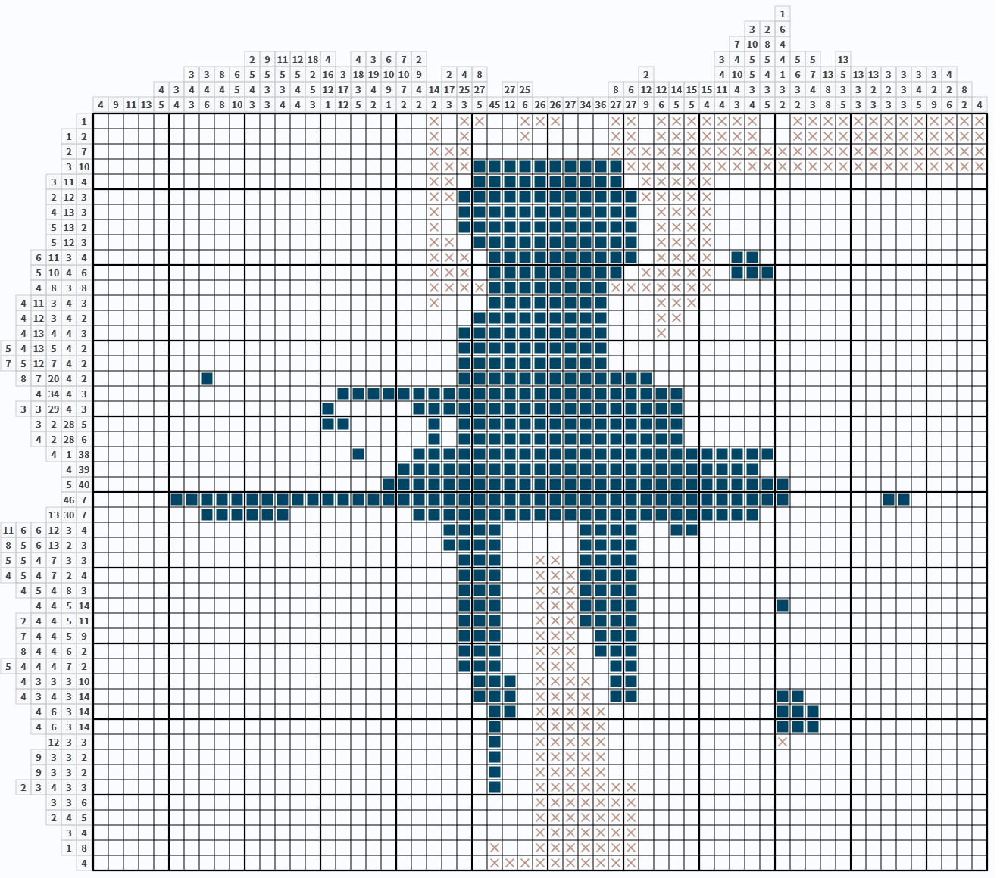

# Nonogram Solver

[](https://www.npmjs.com/package/nonogram-solver)
[](https://travis-ci.org/ThomasR/nonogram-solver)
[](https://codeclimate.com/github/ThomasR/nonogram-solver/coverage)
[](https://codeclimate.com/github/ThomasR/nonogram-solver/code)

Solves black and white Nonogram puzzles (also known as Griddlers, Picross, Hanjie, Japanese Crosswords).  
Can solve large puzzles (>100x100) with low memory usage. Typically requires less than a second for small to medium puzzles.

## Installation

This program requires [Node.js][node] version 8. It might run with other versions, but has not been tested.

Installation is as simple as

``` bash
$ npm install nonogram-solver
```

## Usage

### Command line

Put your input as a JSON file, then run

``` bash
$ npx nonogram-solver input.json
```

You can also pass multiple input files:

``` bash
$ npx nonogram-solver a.json b.json
$ npx nonogram-solver *.json
```

The output directory can be set with the `-o` Option. Use `-h` for help.

### As an npm module

``` js
const solve = require('nonogram-solver');

let {status, puzzle} = solve('input.json');

switch (status) {
case -1:
  console.log('Puzzle is unsolvable!😖');
  break;
case 0:
  console.log('Could not solve puzzle!😞');
  break;
case 1:
  console.log('Puzzle solved!😊');
}
console.log(puzzle.snapshot);
```

### Input format

The input file must be valid JSON containing a `rows` and a `columns` attribute and an optional `content` attribute.

``` js
{
  "rows": [[1], [2]],
  "columns":  [[2], [1]],
  "content": [0, 0, 1, 0] // optional
}
```

Use the `content` attribute to define partially solved puzzles; It should be an array of the values `-1`, `0`, `1`. Here `0` means: unsolved, `1` means: square is known to be occupied, `-1`: square is known to be empty.
It is an error if `content` contains not exactly `rows.length*columns.length` elements.

### Output

If your puzzle is solvable, the solution will be printed to the command line and saved as an svg file to the `output` folder (can be overridden with the `-o` option).

```
Puzzle solved!
                                                           1
                                                         3
                                                          26
                                                        71
                             4                           084
                          111  4367                    34      1
                        2912813    2                     55455 3
                       6     6 1111  248          2    41     1 11
                    338 55552 189009     2              054167353333334
                       5     17     1122 72     86111111
                  43444 433452 349744757  5       2245514333348332234228
                11     1      1         41 2223322
              49135436803344312521222335526667467796554434522385333359624

            1 xxxxxxxxxxxxxxxxxxxx█xxxxxxxxxxxxxxxxxxxxxxxxxxxxxxxxxxxxxx
          1 2 xxxxxxxxxxxxxxxxxxxx█xxxxxxxx██xxxxxxxxxxxxxxxxxxxxxxxxxxxx
          2 7 xxxxxxxxxxxxxxxxxxx██xxxxxx███████xxxxxxxxxxxxxxxxxxxxxxxxx
         3 10 xxxxxxxxxxxxxxxxxxx███xxx██████████xxxxxxxxxxxxxxxxxxxxxxxx
       3 11 4 xxxxxxxxxxxxxxxxxxx███xxx███████████xxxxxx████xxxxxxxxxxxxx
       2 12 3 xxxxxxxxxxxxxxxxxxx██xxx████████████xxxxxx███xxxxxxxxxxxxxx
       4 13 3 xxxxxxxxxxxxxxxxx████xx█████████████xxxxx███xxxxxxxxxxxxxxx
       5 13 2 xxxxxxxxxxxxxxx█████xxx█████████████xxxxx██xxxxxxxxxxxxxxxx
       5 12 3 xxxxxxxxxxxxxx█████xxxxx████████████xxxxx███xxxxxxxxxxxxxxx
     6 11 3 4 xxxxxxxxxxxx██████xxxxxxx███████████xxxxxx███xxxxxx████xxxx
     5 10 4 6 xxxxxxxxxxx█████xxxxxxxxx██████████xxxxxxx████xxxx██████xxx
      4 8 3 8 xxxxxxxxxxx████xxxxxxxxxxx████████xxxxxxxxx███xxx████████xx
   4 11 3 4 3 xxxxxxxxxxx████xxxxxxxxx███████████xxxxxxxx███xx████xxx███x
   4 12 3 4 2 xxxxxxxxxxx████xxxxxxxxx████████████xxxxxxx███xx████xxxx██x
   4 13 4 4 3 xxxxxxxxxxx████xxxxxxxxx█████████████xxxxx████xx████xxxx███
 5 4 13 5 4 2 xxxx█████xx████xxxxxxxxx█████████████xxxx█████xx████xxxxx██
 7 5 12 7 4 2 xxx███████x█████xxxxxxxx████████████xx███████xxx████xxxxx██
   8 7 20 4 2 xx████████x███████xxxxxx████████████████████xxxx████xxxxx██
     4 34 4 3 x████xxx██████████████████████████████████xxxxxx████xxx███x
   3 3 29 4 3 x███xxxx███x█████████████████████████████xxxxxxx████xxx███x
     3 2 28 5 x███xxxx██xxx████████████████████████████xxxxxx█████xxxxxxx
     4 2 28 6 ████xxxx██xxxx████████████████████████████xxxx██████xxxxxxx
       4 1 38 ████xxxx█xxxx██████████████████████████████████████xxxxxxxx
         4 39 ████xxxxxxx███████████████████████████████████████xxxxxxxxx
         5 40 █████xxxx████████████████████████████████████████xxxxxxxxxx
         46 7 x██████████████████████████████████████████████xx███████xxx
      13 30 7 x█████████████x██████████████████████████████xxxx███████xxx
11 6 6 12 3 4 xx███████████xx██████x██████xxx████████████xxxxx███xx████xx
 8 5 6 13 2 3 xxx████████xxx█████xxx██████xxx█████████████xxxx██xxxx███xx
  5 5 4 7 3 3 xxxxxxxxxxxxxx█████xxx█████xxxxx████xx███████xx███xxxxx███x
  4 5 4 7 2 4 xxxxxxxxxxxxxxx████xxx█████xxxxx████xxx███████x██xxxxx████x
    4 5 4 8 3 xxxxxxxxxxxxxxx████xxx█████xxxxx████xxxxx████████xxxxx███xx
     4 4 5 14 xxxxxxxxxxxxxxxx████xxx████xxxxx█████xxxxxx██████████████xx
   2 4 4 5 11 xxxxxxxxxxxx██xx████xxx████xxxxx█████xxxxxxxx███████████xxx
    7 4 4 5 9 xxxxxxxxx███████x████xx████xxxxx█████xxxxxxxxx█████████xxxx
    8 4 4 6 2 xxxxxxxx████████xx████xx████xxxx██████xxxxxxxx██xxxxxxxxxxx
  5 4 4 4 7 2 xxxxxxx█████x████x████xx████xxxxx███████xxxxx██xxxxxxxxxxxx
   4 3 3 3 10 xxxxxxx████xxx███xx███xxx███xxxxx██████████xxxxxxxxxxxxxxxx
   4 3 4 3 14 xxxxxx████xxxx███x████xxx███xxxxxx██████████████xxxxxxxxxxx
     4 6 3 14 xxxxxx████xxxxx██████xxxxx███xxxxxx██████████████xxxxxxxxxx
     4 6 3 14 xxxxxx████xxxxx██████xxxxx███xxxxxxx██████████████xxxxxxxxx
       12 3 3 xxxxxxx████████████xxxxxxx███xxxxxxxxxxxxxxxxxx███xxxxxxxxx
      9 3 3 2 xxxxxxxx█████████xxxxxxxxx███xxxxxxxxxxxxx███xxx██xxxxxxxxx
      9 3 3 2 xxxxxxxxx█████████xxxxxxxx███xxxxxxxxxxxxx███xxx██xxxxxxxxx
    2 3 4 3 3 xxxxxxxxxxxx██x███xxxxxxx████xxxxxxxxxxxxx███xx███xxxxxxxxx
        3 3 6 xxxxxxxxxxxxxxx███xxxxxxx███xxxxxxxxxxxxxxx██████xxxxxxxxxx
        2 4 5 xxxxxxxxxxxxxxxx██xxxxxx████xxxxxxxxxxxxxxxx█████xxxxxxxxxx
          3 4 xxxxxxxxxxxxxxxx███xxxx████xxxxxxxxxxxxxxxxxxxxxxxxxxxxxxxx
          1 8 xxxxxxxxxxxxxxx█xx████████xxxxxxxxxxxxxxxxxxxxxxxxxxxxxxxxx
            4 xxxxxxxxxxxxxxxxxxxx████xxxxxxxxxxxxxxxxxxxxxxxxxxxxxxxxxxx

Output saved to output/result.svg.
```


The same is true if `nonogram-solver` cannot solve your puzzle, but this time the output is going to be a partially finished puzzle.

```
Could not solve puzzle
                                                           1
                                                         3
                                                          26
                                                        71
                             4                           084
                          111  4367                    34      1
                        2912813    2                     55455 3
                       6     6 1111  248          2    41     1 11
                    338 55552 189009     2              054167353333334
                       5     17     1122 72     86111111
                  43444 433452 349744757  5       2245514333348332234228
                11     1      1         41 2223322
              49135436803344312521222335526667467796554434522385333359624

            1 ░░░░░░░░░░░░░░░░░░░░░░x░xx░░xxx░░░xx░xxxxxxx░░xxxxxxxxxxxxx
          1 2 ░░░░░░░░░░░░░░░░░░░░░░x░x░░░x░░░░░xx░xxxxxxx░░xxxxxxxxxxxxx
          2 7 ░░░░░░░░░░░░░░░░░░░░░░xxx░░░░░░░░░xxxxxxxxxxxxxxxxxxxxxxxxx
         3 10 ░░░░░░░░░░░░░░░░░░░░░░xxx██████████xxxxxxxxxxxxxxxxxxxxxxxx
       3 11 4 ░░░░░░░░░░░░░░░░░░░░░░xx░██████████░xxxxx░░░░░░░░░░░░░░░░░░
       2 12 3 ░░░░░░░░░░░░░░░░░░░░░░xx████████████xxxxx░░░░░░░░░░░░░░░░░░
       4 13 3 ░░░░░░░░░░░░░░░░░░░░░░x░████████████░xxxx░░░░░░░░░░░░░░░░░░
       5 13 2 ░░░░░░░░░░░░░░░░░░░░░░x░████████████░xxxx░░░░░░░░░░░░░░░░░░
       5 12 3 ░░░░░░░░░░░░░░░░░░░░░░xx░███████████░xxxx░░░░░░░░░░░░░░░░░░
     6 11 3 4 ░░░░░░░░░░░░░░░░░░░░░░xxx░██████████░xxxx░██░░░░░░░░░░░░░░░
     5 10 4 6 ░░░░░░░░░░░░░░░░░░░░░░xxx░█████████░xxxxx░███░░░░░░░░░░░░░░
      4 8 3 8 ░░░░░░░░░░░░░░░░░░░░░░xxxx████████xxxxxxx░░░░░░░░░░░░░░░░░░
   4 11 3 4 3 ░░░░░░░░░░░░░░░░░░░░░░x░░░████████░░░xxx░░░░░░░░░░░░░░░░░░░
   4 12 3 4 2 ░░░░░░░░░░░░░░░░░░░░░░░░░█████████░░░xx░░░░░░░░░░░░░░░░░░░░
   4 13 4 4 3 ░░░░░░░░░░░░░░░░░░░░░░░░██████████░░░x░░░░░░░░░░░░░░░░░░░░░
 5 4 13 5 4 2 ░░░░░░░░░░░░░░░░░░░░░░░░██████████░░░░░░░░░░░░░░░░░░░░░░░░░
 7 5 12 7 4 2 ░░░░░░░░░░░░░░░░░░░░░░░░██████████░░░░░░░░░░░░░░░░░░░░░░░░░
   8 7 20 4 2 ░░░░░░░█░░░░░░░░░░░░░░░░█████████████░░░░░░░░░░░░░░░░░░░░░░
     4 34 4 3 ░░░░░░░░░░░░░░░░███████████████████████░░░░░░░░░░░░░░░░░░░░
   3 3 29 4 3 ░░░░░░░░░░░░░░░█░░░░░██████████████████░░░░░░░░░░░░░░░░░░░░
     3 2 28 5 ░░░░░░░░░░░░░░░██░░░░░█░███████████████░░░░░░░░░░░░░░░░░░░░
     4 2 28 6 ░░░░░░░░░░░░░░░░░░░░░░█░███████████████░░░░░░░░░░░░░░░░░░░░
       4 1 38 ░░░░░░░░░░░░░░░░░█░░░████████████████████████░░░░░░░░░░░░░░
         4 39 ░░░░░░░░░░░░░░░░░░░░████████████████████████░░░░░░░░░░░░░░░
         5 40 ░░░░░░░░░░░░░░░░░░░███████████████████████████░░░░░░░░░░░░░
         46 7 ░░░░░█████████████████████████████████████████░░░░░░██░░░░░
      13 30 7 ░░░░░░░██████░░░░░░░░███████████████████████░░░░░░░░░░░░░░░
11 6 6 12 3 4 ░░░░░░░░░░░░░░░░░░░░░░░████░░░░░████░░██░░░░░░░░░░░░░░░░░░░
 8 5 6 13 2 3 ░░░░░░░░░░░░░░░░░░░░░░░████░░░░░████░░░░░░░░░░░░░░░░░░░░░░░
  5 5 4 7 3 3 ░░░░░░░░░░░░░░░░░░░░░░░░███░░xx░████░░░░░░░░░░░░░░░░░░░░░░░
  4 5 4 7 2 4 ░░░░░░░░░░░░░░░░░░░░░░░░███░░xxx████░░░░░░░░░░░░░░░░░░░░░░░
    4 5 4 8 3 ░░░░░░░░░░░░░░░░░░░░░░░░███░░xxx████░░░░░░░░░░░░░░░░░░░░░░░
     4 4 5 14 ░░░░░░░░░░░░░░░░░░░░░░░░███░░xxx████░░░░░░░░░█░░░░░░░░░░░░░
   2 4 4 5 11 ░░░░░░░░░░░░░░░░░░░░░░░░███░░xxx████░░░░░░░░░░░░░░░░░░░░░░░
    7 4 4 5 9 ░░░░░░░░░░░░░░░░░░░░░░░░███░░xxx░███░░░░░░░░░░░░░░░░░░░░░░░
    8 4 4 6 2 ░░░░░░░░░░░░░░░░░░░░░░░░███░░xxx░███░░░░░░░░░░░░░░░░░░░░░░░
  5 4 4 4 7 2 ░░░░░░░░░░░░░░░░░░░░░░░░███░░xxx░░██░░░░░░░░░░░░░░░░░░░░░░░
   4 3 3 3 10 ░░░░░░░░░░░░░░░░░░░░░░░░░███░xxxx░██░░░░░░░░░░░░░░░░░░░░░░░
   4 3 4 3 14 ░░░░░░░░░░░░░░░░░░░░░░░░░███░xxxx░██░░░░░░░░░██░░░░░░░░░░░░
     4 6 3 14 ░░░░░░░░░░░░░░░░░░░░░░░░░░██░xxxxx░░░░░░░░░░░███░░░░░░░░░░░
     4 6 3 14 ░░░░░░░░░░░░░░░░░░░░░░░░░░█░░xxxxx░░░░░░░░░░░███░░░░░░░░░░░
       12 3 3 ░░░░░░░░░░░░░░░░░░░░░░░░░░█░░xxxxx░░░░░░░░░░░x░░░░░░░░░░░░░
      9 3 3 2 ░░░░░░░░░░░░░░░░░░░░░░░░░░█░░xxxxx░░░░░░░░░░░░░░░░░░░░░░░░░
      9 3 3 2 ░░░░░░░░░░░░░░░░░░░░░░░░░░█░░xxxxx░░░░░░░░░░░░░░░░░░░░░░░░░
    2 3 4 3 3 ░░░░░░░░░░░░░░░░░░░░░░░░░░█░░xxxxxxx░░░░░░░░░░░░░░░░░░░░░░░
        3 3 6 ░░░░░░░░░░░░░░░░░░░░░░░░░░░░░xxxxxxx░░░░░░░░░░░░░░░░░░░░░░░
        2 4 5 ░░░░░░░░░░░░░░░░░░░░░░░░░░░░░xxxxxxx░░░░░░░░░░░░░░░░░░░░░░░
          3 4 ░░░░░░░░░░░░░░░░░░░░░░░░░░░░░xxxxxxx░░░░░░░░░░░░░░░░░░░░░░░
          1 8 ░░░░░░░░░░░░░░░░░░░░░░░░░░x░░xxxxxxx░░░░░░░░░░░░░░░░░░░░░░░
            4 ░░░░░░░░░░░░░░░░░░░░░░░░░░xxxxxxxxxx░░░░░░░░░░░░░░░░░░░░░░░

Output saved to output/result.svg.
```




Additionally, it prints the current `content` in this case (omitted in the sample above). The content is given in the format [described above](#input-format).

## Where can I get some puzzles for testing?

Some samples are included in the `puzzles` folder. If you want more, run

``` bash
$ npx nonogram-dl-samples
```

This will download selected puzzles from [nonograms.org](http://www.nonograms.org/). The files themselves are not included in this package for copyright reasons.

Now you can run `nonogram-solver puzzles/nonograms.org/*.json`.

## How does it work?

See [internals.md](./doc/internals.md).


[](LICENSE)

[node]: https://nodejs.org/
